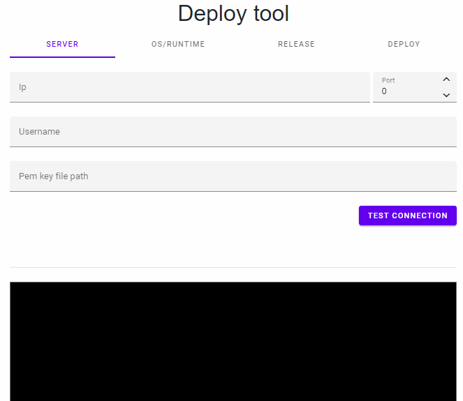

# Dotnet.DeployTool

Work in progress. A small tool to help people deploy their Dotnet core projects to Linux servers.

Eg:

* Ubuntu LTS versions
* Amazon Linux
* Centos
* Debian
* Rasperri Pi
* Maybe other Linux destros in the future aswell
* Dotnet Core 3.1
* Dotnet Core 2.1
* Dotnet Core 5.1 (When released)

These are just the starter features I want to add. Perhaps other deployment options like Blazor WASM will be supported too.

Small preview of tool can be seen below here:

Stack so far:

* (Client CLI) Console App
* (Client Web) Blazor WASM
* (Server) AspNetCore WebAPI + SignalR

Have some ideas to add storage to the solution, so it can remember setup after restart of app. Further more I have idea to make this a global tool for easy install and single runable exe for download. This will not be hosted online. I want user's to feel safe that nothing they type will ever be shared.

/Wave